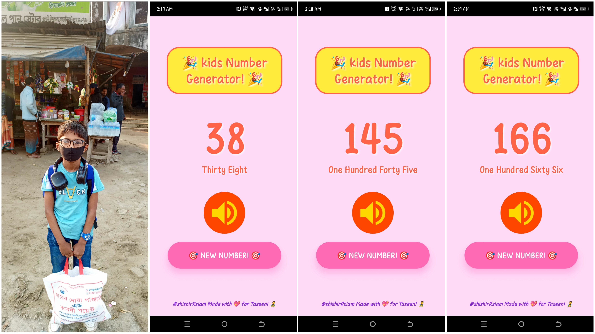

<p align="left">  </p>

# 🎉 Kids Number Generator Using ReactNative

A fun and interactive **random number generator** for kids! This React Native app generates a random number between **1 and 500**, converts it to text, and speaks it aloud using the **Expo Speech API**. It also includes an engaging animation to make learning numbers more fun for children.




## 📱 Features
- Generates a random number between **1 and 500**.
- Converts the number into text.
- Uses the **Expo Speech API** to read the number aloud.
- Includes a bouncing animation when generating a new number.
- **Kid-friendly UI** with emojis and fun colors.

## 🚀 Technologies Used
- **React Native**
- **Expo** (for speech synthesis)
- **Animated API** (for bounce effect)
- **react-native-vector-icons** (for icons)

## 📥 Download
Click below to download the **Android App**: [⬇️ Download APK](https://drive.google.com/file/d/1tm3MANUn62PW5vBHl-DKORbaetmBTtoD/) 


## 🎮 How to Use
1. Click the **"🎯 New Number! 🎯"** button to generate a random number.
2. See the number displayed with a fun bounce effect.
3. The number is converted into text and displayed below.
4. Tap the **🔊 Speak Button** to hear the number spoken aloud.


## 📥 Installation
### Prerequisites
Ensure you have **Node.js** and **Expo CLI** installed on your machine.

```sh
npm install -g expo-cli
```

### Clone the Repository
```sh
git clone https://github.com/shishirRsiam/Kids-Number-Generator-Using-ReactNative.git
cd Kids-Number-Generator-Using-ReactNative
```

### Install Dependencies
```sh
npm install
```

### Run the App
```sh
npm start
```

Scan the QR code with your **Expo Go** app to run it on your mobile device.

## 🛠 Project Structure
```
📂 Kids-Number-Generator-Using-ReactNative
 ┣ 📜 App.js                  # Main app component
 ┣ 📜 styles.js               # Stylesheet for the app
 ┣ 📜 NumberToText.js         # Converts numbers to text
 ┣ 📜 package.json            # Dependencies and scripts
 ┣ 📜 App-Home-Interface.jpg  # App Home Interface
 ┣ 📜 README.md               # Documentation
```

## 💖 Made For
Created with 💖 by **@shishirRsiam** for **Taseen! 👨‍👧**


<p align="left">  </p>
